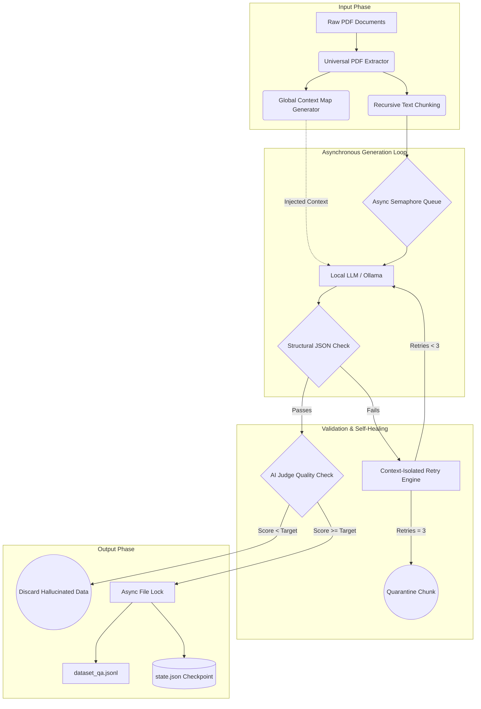
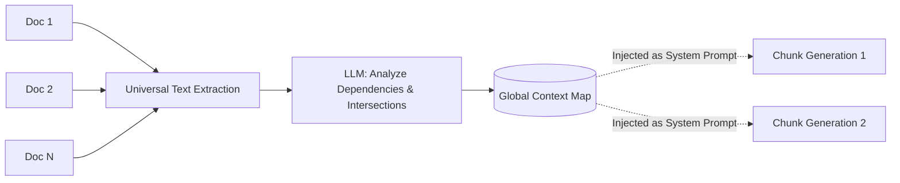
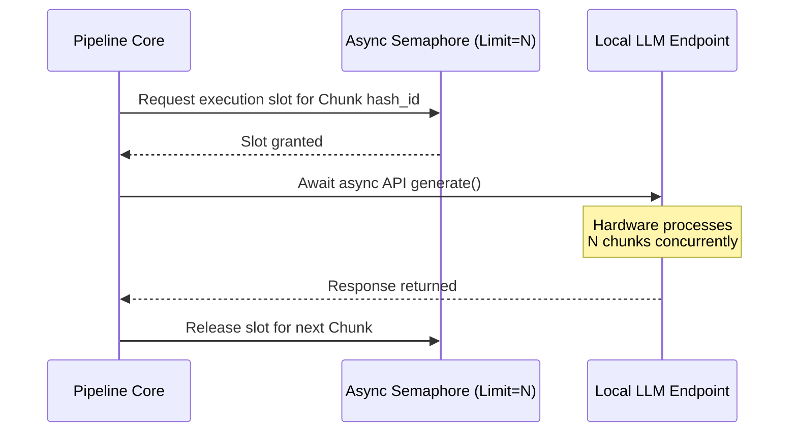
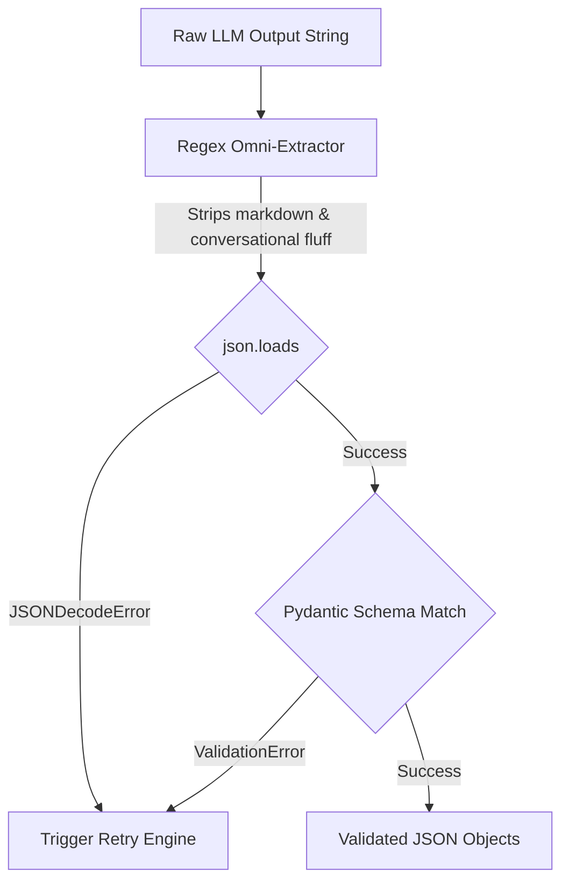
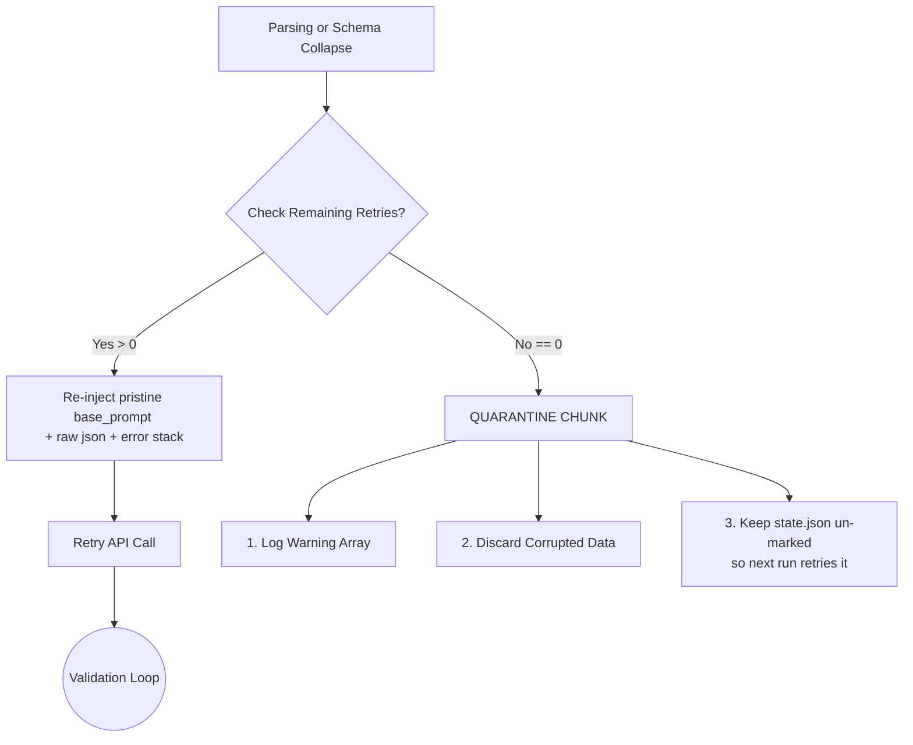
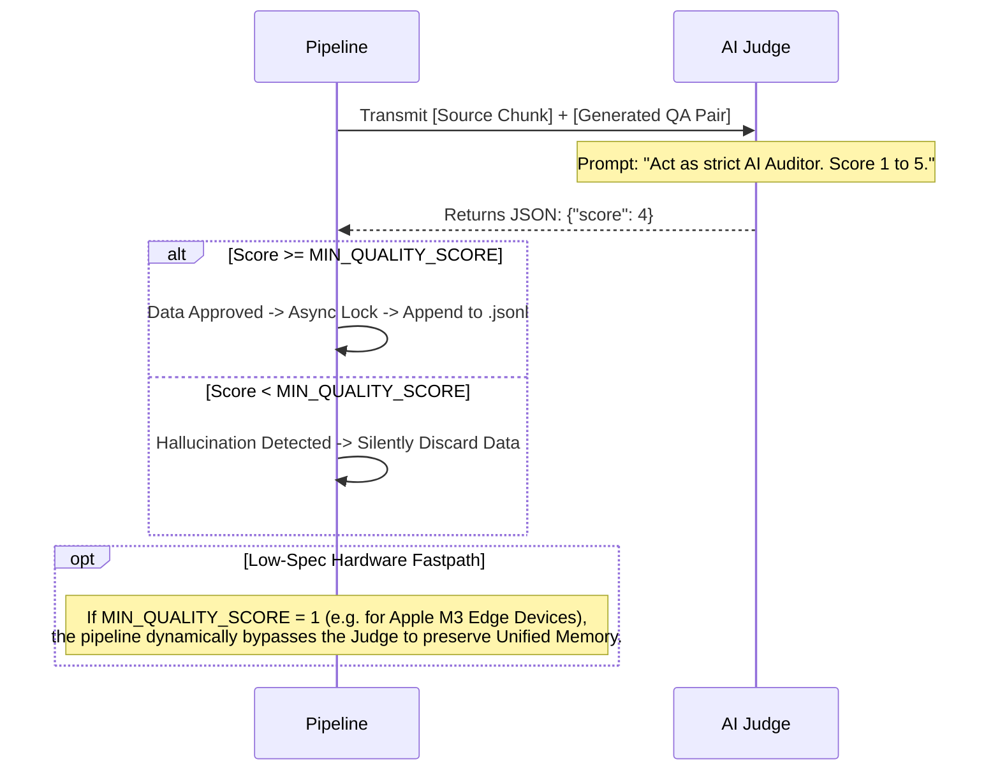

# 📄 Doc2SFT: Enterprise SLM Fine-Tuning Data Generation Pipeline


**Doc2SFT** is a resilient, fault-tolerant, and hardware-optimized data generation pipeline. It automatically ingests raw PDF documents and utilizes Local LLMs (via Ollama) to autonomously generate high-quality, hallucination-free `QA` (Direct Answer) or `CoT` (Chain-of-Thought) training datasets in the standard **ShareGPT** format, ready for immediate model fine-tuning.

---

## 💡 Why Doc2SFT?

The Open Source community has access to incredible Small and Mid-size Language Models like Qwen2 (lightweight 1.5B/7B), Llama-3 (8B), and highly capable mid-range models like Qwen3 (14B). However, the biggest bottlenecks for fine-tuning these models on proprietary enterprise data are **Data Privacy** and **Data Quality**.

When asking an AI to generate training data from raw proprietary text, standard scripts and cloud APIs fail due to:
1. **The Cloud Privacy Breach:** Sending internal enterprise PDFs to external cloud APIs exposes highly sensitive IP and trade secrets to third-party model providers.
2. **JSON Formatting Collapse:** Smaller local models frequently break JSON structures, causing offline pipelines to crash entirely.
3. **Chunk Myopia:** Text chunking destroys document-wide context, leading to inaccurate QA pairs.
4. **The "Garbage In" Problem:** Without strict validation, LLMs generate hallucinated or low-quality data.
5. **Hardware Exhaustion:** Processing long contexts rapidly overwhelms Unified Memory on edge devices or standard GPUs.

**Doc2SFT solves this.** It is an **offline-first, 100% locally isolated** solution. By integrating directly with local LLMs via Ollama, it guarantees that your proprietary input data never leaves your infrastructure or gets exposed to the cloud. 

Engineered as a bulletproof state-machine, it safely extracts golden data across any environment—from an **M3 MacBook Air with 16 GB RAM** running a lightweight 1.5B model, up to ultra-large scale configurations on enterprise cluster infrastructure. You get cloud-grade dataset generation with absolute, air-gapped data security.

---

## 🏗️ Core Architecture & Design Logic

### Master Blueprint: End-to-End Pipeline Flow
Before diving into the specific mechanisms, here is the macro view of how Doc2SFT processes documents from raw input to fine-tune-ready output.



---

### The 5 Architectural Pillars
Doc2SFT is built on five highly isolated, fault-tolerant architectural blocks that power the end-to-end flow above.

#### 1. Global Context Map Generator (Anti-Myopia)
Before chunking begins, the pipeline extracts all text and forces the LLM to generate a cross-document map. This solves the "Chunk Myopia" problem by giving the AI situational awareness of the entire domain, even when it is only processing a small 500-word slice.



#### 2. Asynchronous Processing Loop
To maximize GPU/Unified Memory utilization without causing out-of-memory (OOM) crashes, chunk processing is handled by an asynchronous semaphore queue. Concurrency limits are strictly controlled by the `.env` configuration.



#### 3. Structural JSON & Pydantic Validation
Lightweight models frequently add conversational fluff (e.g., *"Here is your data:"*) or forget brackets. The pipeline uses an Omni-Directional Regex Extractor to strip noise, followed by strict Pydantic schema matching to guarantee dataset integrity.



#### 4. Context-Isolated Retry Engine
If JSON validation fails, the pipeline does *not* recursively append error messages to the old prompt (which bloats context and confuses small models). Instead, it isolates the error and re-injects it against a pristine `base_prompt`.



#### 5. LLM-as-a-Judge (Hallucination Defense)
Even if an LLM outputs perfect JSON, it may hallucinate facts. Doc2SFT deploys a secondary, zero-temperature "Auditor" prompt to ruthlessly grade the generated data against the original ground-truth chunk. 



---

## 📂 Project Structure

```text
Doc2SFT/
├── data_input/                   # Drop your source PDFs here (Git ignored)
│   └── .gitkeep
├── data_output/                  # Final ShareGPT SFT training datasets saved here
│   └── .gitkeep
├── logs/                         # State engine checkpointing & pipeline logs
│   ├── pipeline_run.log
│   └── state.json                # Continuous state tracker for zero-loss recovery
├── .env.example.m3air_qwen2-1.5b # Blueprint template for lightweight edge hardware
├── .env.example.m5pro_qwen3-14b  # Blueprint template for lightweight edge hardware
├── .gitignore                    # Enforces strict data and token credential isolation
├── generate_data.py              # Core asynchronous framework file
└── requirements.txt              # Verified project dependency configuration
```

---

## 🚀 Getting Started

### Prerequisites
1. **Python 3.10+**
2. **Ollama** installed and running locally (or pointing to a remote server).
3. Pull your target model: `ollama run qwen2:1.5b` (or your model of choice).

### Installation
```bash
# Clone the repository
git clone [https://github.com/yourusername/Doc2SFT.git](https://github.com/yourusername/Doc2SFT.git)
cd Doc2SFT

# Install dependencies
pip install -r requirements.txt

# Create necessary directories to preserve git structure
touch data_input/.gitkeep data_output/.gitkeep logs/.gitkeep
```

---

## ⚙️ Configuration & Execution

### Step 1: Configure your `.env` Profile
Doc2SFT is deeply customizable. Copy a provided blueprint to create your active `.env` file based on your hardware:

**For Edge Devices (e.g., M3 Air with 16GB RAM):**
```bash
cp .env.example.m3air_qwen2-1.5b .env
```
**For Workstations (e.g., M5 Pro with 24GB RAM):**
```bash
cp .env.example.m5pro_qwen3-14b .env
```

Open the `.env` file and tune the parameters to match your hardware and dataset goals. 

**LLM & Endpoint Configuration**
* `OLLAMA_HOST`: The URL of your local or remote Ollama instance (default: `http://localhost:11434`).
* `OLLAMA_MODEL`: The model used for generation and judging (e.g., `qwen2:1.5b` for edge hardware, `qwen3:14b` or larger for workstations).

**Pipeline Behavior**
* `TARGET_YIELD`: The total number of high-quality data pairs you want extracted across all documents.
* `GENERATION_STYLE`: Set to `qa` for direct knowledge-extraction, or `cot` for reasoning paths.
* `SYSTEM_PROMPT`: Hardcode your target persona to prevent model drift (e.g., `"You are an expert AI governance assistant."`), or set to `auto` to let large models infer the domain dynamically.

**Quality & Hardware Constraints (CRITICAL)**
* `MIN_QUALITY_SCORE`: (Scale 1-5). Sets the threshold for the AI Judge. Set to `1` to bypass the judge entirely if you want maximum speed on small models, or `4` for strict enterprise quality using mid-range models (14B+).
* `CONCURRENCY_LIMIT`: Controls async chunking execution. **Set to `1`** for 16GB Unified Memory (M2/M3 MacBooks) to prevent swap thrashing and lockups. Scale up to `2-5` if running on high-VRAM clusters or M5 Pro setups.
* `OLLAMA_NUM_CTX_QA`: Context window size. Set carefully based on your VRAM (e.g., `4096` for standard QA, `8192` for CoT).

### Step 2: Run the Pipeline

1. **Input:** Drop your target `.pdf` files into the `/data_input` folder.
2. **Execute:** Start the generation process.
   ```bash
   python generate_data.py
   ```
3. **Output:** Your pristine, fine-tune-ready data will be saved in `/data_output/dataset_qa.jsonl` (or `dataset_cot.jsonl`).

*Note: If the script is interrupted, simply run it again. The asynchronous `state.json` tracker will automatically pick up exactly where it left off.*

### Example Output (ShareGPT Format)
The generated data is perfectly structured for immediate ingestion into frameworks like **Axolotl**, **MLX**, **Llama-Factory**, or **Unsloth**:
```json
{
  "messages": [
    {
      "role": "system",
      "content": "You are an expert AI governance and machine learning architecture assistant."
    },
    {
      "role": "user",
      "content": "Identify the robustness challenge for LLMs in the provided use cases."
    },
    {
      "role": "assistant",
      "content": "Stability under adversarial conditions and prompt-injection attacks."
    }
  ]
}
```

---

## 🤝 Contributing

Doc2SFT thrives on community input! Whether you are optimizing token usage, adding support for new document types (.docx, .md), or integrating alternative inference endpoints (vLLM, OpenAI API), your contributions are welcome.

**How to contribute:**
1. Fork the repository.
2. Create a feature branch (`git checkout -b feature/AmazingFeature`).
3. Commit your changes (`git commit -m 'Add some AmazingFeature'`).
4. Push to the branch (`git push origin feature/AmazingFeature`).
5. Open a Pull Request.

When opening a PR, please ensure your code handles asynchronous state locks safely, as data purity is the primary directive of this project.

## 📜 License
Distributed under the MIT License. See `LICENSE` for more information.