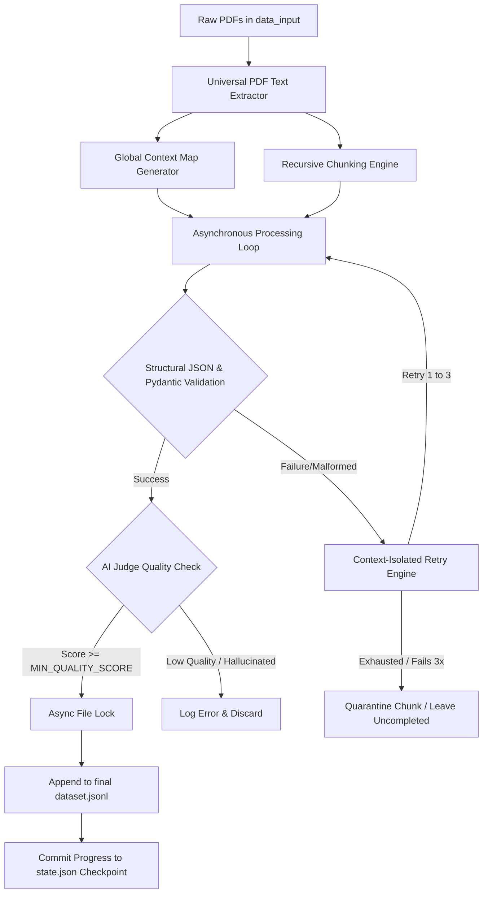

# 📄 Doc2SFT: Enterprise SLM Fine-Tuning Data Generation Pipeline


**Doc2SFT** is a resilient, fault-tolerant, and hardware-optimized data generation pipeline. It automatically ingests raw PDF documents and utilizes Local LLMs (via Ollama) to autonomously generate high-quality, hallucination-free `QA` (Direct Answer) or `CoT` (Chain-of-Thought) training datasets in the standard **ShareGPT** format, ready for immediate model fine-tuning.

---

## 💡 Why Doc2SFT?

The Open Source community has access to incredible Small Language Models (SLMs) like Qwen2 (lightweight 1.5B/7B) and Llama-3 (8B). However, the biggest bottleneck for fine-tuning these models on proprietary enterprise data is **Data Quality**.

When asking an LLM to generate training data from raw text, standard scripts fail due to:
1. **JSON Formatting Collapse:** Smaller models frequently break JSON structures, causing pipelines to crash entirely.
2. **Chunk Myopia:** Text chunking destroys document-wide context, leading to inaccurate QA pairs.
3. **The "Garbage In" Problem:** Without strict validation, LLMs generate hallucinated or low-quality data.
4. **Hardware Exhaustion:** Processing long contexts rapidly overwhelms Unified Memory on edge devices or standard GPUs.

**Doc2SFT solves this.** It is engineered as a bulletproof state-machine that safely extracts golden data across any environment—from an **M3 MacBook Air with 16 GB RAM** running a lightweight 1.5B model, up to ultra-large scale configurations on enterprise cluster infrastructure. The pipeline's scaling capability is constrained entirely by your available hardware footprint, not by software limitations.

---

## 🏗️ Core Architecture & Design Logic

Doc2SFT is not just a prompt wrapper; it is an intelligent, self-healing pipeline built on four architectural pillars:

### 1. Architectural Pipeline Flow
The entire framework operates as an asynchronous, non-blocking pipeline designed to enforce structural and factual consistency at every checkpoint.



### 2. The Context-Isolated Self-Healing Retry Loop
To guarantee that lightweight models do not enter an uncontrollable error loop, the self-healing retry block keeps a strict isolation layer. Instead of appending old error chains recursively, it reference-checks a pristine `base_prompt` every time.

```text
+------------------------------------------------------------------------+
|                      Processing Chunk Async Loop                       |
+------------------------------------------------------------------------+
                                    |
                                    v
                       [ Generate Ollama Response ]
                                    |
                                    v
                     { Extract JSON Bracket Bounds }
                                    |
                    +---------------+---------------+
                    |                               |
          [ Valid JSON Array ]             [ Parsing/Schema Collapse ]
                    |                               |
                    v                               v
         ( Trigger LLM As A Judge )         ( Log Exception Status )
                    |                               |
           +--------+--------+                      v
           |                 |          { Check Remaining Retries? }
    [ Pass Score ]    [ Low Score ]                 |
           |                 |             +--------+--------+
           v                 v             |                 |
     ( File Lock )    ( Clear Memory )  [ Yes > 0 ]      [ No == 0 ]
           |                 |             |                 |
           v                 v             v                 v
   { Save Progress }    { Discard }  ( Re-inject pristine )  ( Quarantine Chunk )
                                     ( base_prompt + raw  )  ( Do Not Save to   )
                                     ( json + error stack )  ( state.json Check )
```

### 3. Global Context Mapping (Anti-Myopia)
Before chunking, the pipeline scans the documents to generate a cross-document **Global Context Map**. This map is injected into every subsequent chunk generation, ensuring the AI maintains situational awareness of the broader domain, even when analyzing a fragmented 500-word slice.

### 4. Zero-Byte Resilient State Preservation
Network timeouts or out-of-memory errors happen. Doc2SFT features a continuous asynchronous state tracker (`state.json`). If the pipeline is interrupted, simply run it again. It will instantly skip successfully processed chunks, safely quarantine unrecoverable chunks, and seamlessly resume data extraction without duplicating a single line of data.

---

## 📂 Project Structure

```text
Doc2SFT/
├── data_input/             # Drop your source PDFs here (Git ignored)
│   └── .gitkeep
├── data_output/            # Final ShareGPT SFT training datasets saved here
│   └── .gitkeep
├── logs/                   # State engine checkpointing & pipeline logs
│   ├── pipeline_run.log
│   └── state.json          # Continuous state tracker for zero-loss recovery
│   └── .gitkeep
├── .env.example.m3air_16gb # Blueprint template for lightweight edge hardware
├── .gitignore              # Enforces strict data and token credential isolation
├── generate_data.py        # Core asynchronous framework file
└── requirements.txt        # Verified project dependency configuration
```

---

## 🚀 Getting Started

### Prerequisites
1. **Python 3.10+**
2. **Ollama** installed and running locally (or pointing to a remote server).
3. Pull your target model: `ollama run qwen2:1.5b` (or your model of choice).

### Installation
```bash
# Clone the repository
git clone [https://github.com/yourusername/Doc2SFT.git](https://github.com/yourusername/Doc2SFT.git)
cd Doc2SFT

# Install dependencies
pip install -r requirements.txt

# Create necessary directories
touch data_input/.gitkeep data_output/.gitkeep logs/.gitkeep
```

### Configuration
Doc2SFT relies on a strict `.env` file for execution behavior. We provide optimized profile templates for different hardware setups.

Copy the provided example profile to create your active `.env`:
```bash
# Example: Optimized for Apple M3 Air with 16 GB RAM using a lightweight 1.5B model
cp .env.example.m3air_16gb .env
```

**Key `.env` Parameters:**
* `GENERATION_STYLE`: Set to `qa` (Direct Question/Answer) or `cot` (Chain-of-Thought reasoning).
* `CONCURRENCY_LIMIT`: Controls memory pressure. Set to `1` for 16GB RAM/MacBooks to prevent swap thrashing, or scale up on massive multi-GPU/cluster rigs.
* `SYSTEM_PROMPT`: Hardcode your target persona (e.g., `"You are an expert AI governance assistant."`) or set to `auto` for large models to auto-detect the domain.

---

## ⚙️ Usage

1. **Input:** Drop your target `.pdf` files into the `/data_input` folder.
2. **Execute:** Run the pipeline.
   ```bash
   python generate_data.py
   ```
3. **Output:** Your pristine, fine-tune-ready data will be saved in `/data_output/dataset_qa.jsonl` (or `dataset_cot.jsonl`).

### Example Output (ShareGPT Format)
The generated data is perfectly structured for immediate ingestion into frameworks like **Axolotl**, **MLX**, **Llama-Factory**, or **Unsloth**:
```json
{
  "messages": [
    {
      "role": "system",
      "content": "You are an expert AI governance and machine learning architecture assistant."
    },
    {
      "role": "user",
      "content": "Identify the robustness challenge for LLMs in the provided use cases."
    },
    {
      "role": "assistant",
      "content": "Stability under adversarial conditions and prompt-injection attacks."
    }
  ]
}
```

---

## 🤝 Contributing

Doc2SFT thrives on community input! Whether you are optimizing token usage, adding support for new document types (.docx, .md), or integrating alternative inference endpoints (vLLM, OpenAI API), your contributions are welcome.

**How to contribute:**
1. Fork the repository.
2. Create a feature branch (`git checkout -b feature/AmazingFeature`).
3. Commit your changes (`git commit -m 'Add some AmazingFeature'`).
4. Push to the branch (`git push origin feature/AmazingFeature`).
5. Open a Pull Request.

When opening a PR, please ensure your code handles asynchronous state locks safely, as data purity is the primary directive of this project.

## 📜 License
Distributed under the MIT License. See `LICENSE` for more information.
```